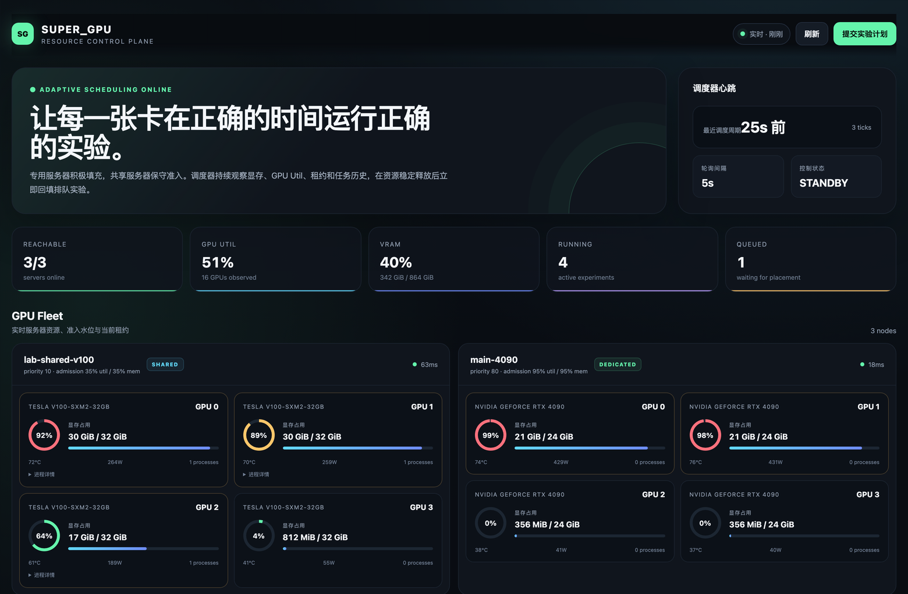
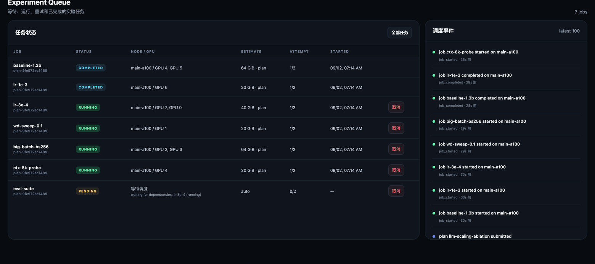

# super_gpu

**面向 AI Agent 的资源感知多服务器 GPU 实验调度系统。**

[](https://github.com/asimfish/super_gpu/actions/workflows/ci.yml)
[](https://www.python.org/downloads/)
[](LICENSE)

[English](README.md) | 简体中文

`super_gpu` 持续采集每张卡的显存、GPU 利用率、温度、功耗和进程信息，按照服务器角色与任务资源需求自动放置实验，并全程监管——自动续租、失败重试、在 GPU 释放后立即回填新任务。它天生为交给 AI Agent 使用而设计：把仓库链接、服务器列表和实验计划交给 Agent，它就能跑完整个实验批次。



<sub>无需任何 GPU 服务器即可复现上图：`python3 scripts/demo_dashboard.py`
会构造一个三节点模拟集群并在其上运行真实 Dashboard，见[先试玩](#先试玩无需-gpu)。</sub>

## 目录

- [核心特性](#核心特性)
- [为什么选 super_gpu](#为什么选-super_gpu)
- [直接交给 Agent](#直接交给-agent)
- [架构](#架构)
- [快速开始](#快速开始)
- [节点策略](#节点策略)
- [实验计划](#实验计划)
- [资源估算](#资源估算)
- [MCP 服务](#mcp-服务)
- [异常占用巡检](#异常占用巡检)
- [REST API](#rest-api)
- [安全](#安全)
- [当前边界](#当前边界)
- [路线图](#路线图)
- [文档](#文档)
- [开发](#开发)
- [许可证](#许可证)

## 核心特性

- **专用服务器积极填充**：显存 best-fit 加目标利用率，尽量减少碎片、提高并行吞吐。
- **共享服务器保守准入**：只有显存和利用率连续多个采样都处于低水位时才投放任务，绝不干扰别人的程序。
- **持续补位**：调度器每隔数秒重采集集群状态，任何 GPU 稳定释放后立即从 pending 队列挑选合适实验。
- **会学习的资源估算**：首轮使用计划声明或保守启发值；完成后记录实际峰值显存与运行时长，后续相同任务自动采用历史估算。OOM 会自动提高下一次显存预算。
- **可靠运行**：远端命令通过持久 runner 执行，PID、日志和退出码文件持久化；控制器重启后可以完整恢复对每个任务的监管。
- **可解释调度**：每个 pending 任务实时携带 `pending_reason`——哪条规则排除了哪个节点、触到了哪个并行上限、在等哪个依赖——Dashboard、API、CLI 都能看到，"为什么还没跑"不用猜。
- **类型化结果，不止退出码**：任务可在退出前把 JSON 判定（如 `scientific_reject`）写入 `$SUPER_GPU_RESULT_FILE`；依赖谓词（`after: "result"` + `result_states`）按判定路由下游任务，无法满足的分支标记为 `skipped` 而非 `failed`。
- **声明式产物**：任务用 `outputs` 声明工作目录相对的 glob 清单；结束后 `super-gpu pull <job-id>` 在运行节点展开并一次归档拉回，不再手工 scp 考古。
- **不可变实验快照**：提交时生成确定性源码归档，以 SHA-256 内容寻址；远端校验 digest 后再为每个 job 解包独立副本，节点上已有同 digest 时直接跳过传输。
- **幂等提交**：稳定 `request_id` 与实验意图摘要同事务落库；超时重试返回原计划，相同 ID 配不同内容返回 HTTP 409。
- **强任务身份**：runner 同时校验 launch token、PID 与 Linux 进程启动时钟，拒绝向 PID 复用后的无关进程发信号。
- **Agent 优先接口**：同时提供 CLI、REST 和 MCP；仓库内置 [`AGENTS.md`](AGENTS.md) 操作契约与实验计划 [JSON Schema](schemas/experiment-plan.schema.json)。
- **实时前端**：无外部 CDN 依赖的 Dashboard，实时展示全部服务器、GPU、租约、实验队列与调度事件。

## 为什么选 super_gpu

| 替代方案 | 典型场景 | super_gpu 的差异 |
|---|---|---|
| Slurm / K8s + Kueue | 有管理员权限的大型托管集群 | 零集群基础设施：任何能 SSH 的机器几分钟内变成节点，包括你没有管理权限的共享实验室机器 |
| Ray 等分布式框架 | 代码按框架 API 编写 | 任务就是普通 shell 命令——不用 import 任何东西，节点上没有常驻 daemon |
| gpustat / nvitop 类监控 | 人眼盯卡 | 同样的遥测直接喂给真正的调度器：放置、监管、重试、回填 |
| 手工 tmux + `CUDA_VISIBLE_DEVICES` | 单机、少量实验 | 会学习的资源估算、共享机礼仪、幂等提交、类型化结果、产物回收 |

设计目标是填补「实验室有 Slurm」和「我只有几台能 SSH 的机器，其中一些是共享的」之间的空档：把专用机器压满、绝不打扰共享机器上别人的任务，并且全程可由 AI Agent 操作。

## 直接交给 Agent

把仓库链接 <https://github.com/asimfish/super_gpu>、实验计划和服务器列表交给 Agent 即可。支持仓库指令的 Agent 会自动读取根目录 [`AGENTS.md`](AGENTS.md)；支持 Agent Skills 的环境还可以安装或显式加载 [`skills/super-gpu`](skills/super-gpu/SKILL.md)。

仓库内的 Agent 契约要求它自动完成：

1. 克隆并安装 `super_gpu`。
2. 把服务器列表转成不会提交到 Git 的私有 `config.json`，明确标记 `dedicated`（主服务器）或 `shared`（共享服务器）。
3. 校验实验计划并检查 SSH、工作目录和 `nvidia-smi`。
4. 启动或复用长期运行的 controller 和 Dashboard。
5. 提交实验，持续查看状态和调度事件，直到全部任务进入终态。
6. 让 controller 在后续扫描中自动利用刚释放且已稳定的 GPU，无需 Agent 手工挑卡。

可以直接把下面这句话连同计划和服务器列表发给 Agent：

```text
使用 https://github.com/asimfish/super_gpu，遵循仓库 AGENTS.md 和
skills/super-gpu/SKILL.md，校验并编排我的实验；持续监管到所有任务结束，
同时保护 shared 服务器上的其他用户任务。
```

仍需提前保证 Agent 所在控制机能通过 SSH 访问这些服务器——仓库链接本身不提供任何凭据。对于从未运行过的任意程序，系统无法仅凭命令精确预知显存；可以首次显式填写预算，或接受保守启发值，之后会自动使用历史峰值校准。

## 架构

```text
Experiment plan / Agent / Dashboard
                 │
          REST · CLI · MCP
                 │
        ┌────────▼────────┐
        │ Scheduler loop  │  monitor → reconcile → renew → place/backfill
        └───┬─────────┬───┘
            │         │
        SQLite      SSH runner
     desired state   persistent PID/log/exit files
            │         │
            └──── GPU servers
```

一个调度周期严格按照以下顺序运行：

1. 并行查询所有节点的 `nvidia-smi`。
2. 恢复并监管 `starting/running/cancelling` 任务。
3. 更新峰值显存、日志与租约 heartbeat。
4. 处理完成、失败、OOM、超时、取消和重试。
5. 用最新快照对 pending jobs 做 placement。
6. 启动所有当前能够安全放置的实验。

组件边界与失败模型见 [docs/ARCHITECTURE.md](docs/ARCHITECTURE.md)，快照、幂等与 watchdog 背后的设计决策见 [docs/adr/](docs/adr)。

## 快速开始

### 先试玩（无需 GPU）

```bash
git clone https://github.com/asimfish/super_gpu.git
cd super_gpu
python3 scripts/demo_dashboard.py
```

这会构造一个三节点模拟集群（两台专用、一台被其他用户占用的共享机），把一个小型消融计划跑过真实调度器，然后在 <http://127.0.0.1:8899> 提供 Dashboard——已完成、运行中、排队中的任务齐全，每个排队任务都带实时 `pending_reason`。本 README 的全部截图都出自这条命令。

### 真实集群

要求：控制机 Python 3.10+；目标服务器为 NVIDIA GPU，安装 `nvidia-smi`，并可通过 `~/.ssh/config` 中的别名免交互连接。

```bash
git clone https://github.com/asimfish/super_gpu.git
cd super_gpu
python3 -m venv .venv
.venv/bin/pip install -e ".[mcp]"

cp examples/nodes.example.json config.json
# 修改节点别名、role、workspace 和阈值

# 已有 gpumgr 节点清单时，可生成默认全部为 shared 的私有配置
.venv/bin/super-gpu import-gpumgr \
  --source ~/.config/gpumgr/nodes.json \
  --output ~/.config/super_gpu/config.json

.venv/bin/super-gpu --config config.json validate \
  --plan examples/experiment.example.json
.venv/bin/super-gpu --config config.json doctor
.venv/bin/super-gpu --config config.json serve
```

打开 <http://127.0.0.1:8765> 即可看到实时监控前端。另一个终端提交计划：

```bash
.venv/bin/super-gpu submit examples/experiment.example.json \
  --request-id learning-rate-sweep-001 \
  --url http://127.0.0.1:8765

.venv/bin/super-gpu jobs --url http://127.0.0.1:8765
.venv/bin/super-gpu events --url http://127.0.0.1:8765
```

也可以不启动 HTTP 服务，直接运行并等待计划结束：

```bash
.venv/bin/super-gpu --config config.json run experiment.json
```

`scripts/supergpu` 是可选的 macOS launchd 管理脚本（`supergpu start|stop|restart|status|logs|open`），用于让 controller 跨登录持续运行；使用前按自己的机器调整 plist label 和端口。

## 节点策略

节点必须显式标记角色：

```json
{
  "name": "main-a100",
  "ssh": "main-a100",
  "role": "dedicated",
  "priority": 100,
  "workspace": "/data/project",
  "policy": {
    "max_gpu_utilization": 94,
    "max_memory_used_ratio": 0.94,
    "reserve_memory_mib": 2048,
    "stabilization_samples": 1,
    "allow_colocation": true,
    "max_jobs_per_gpu": 2
  }
}
```

| 字段 | 作用 |
|---|---|
| `role` | `dedicated` 优先且可积极填充；`shared` 保守准入 |
| `priority` | 同类节点之间的显式优先级 |
| `max_gpu_utilization` | 当前 Util 达到该值时不再加入任务 |
| `max_memory_used_ratio` | 放入新任务后的最大显存水位 |
| `reserve_memory_mib` | 给驱动、波动和估算误差保留的安全空间 |
| `stabilization_samples` | 连续多少次采样满足阈值才准入；共享机建议至少 3 |
| `allow_colocation` | 是否允许多个 super_gpu job 共用同一卡 |
| `max_jobs_per_gpu` | 单卡最多并置多少个受管任务 |

共享节点默认阈值为 35% Util、35% 显存、连续 3 次稳定、禁止并置。即使某张共享卡瞬间空闲，也会先观察稳定性，避免抢占别人阶段性波动的任务。

## 实验计划

完整示例见 [examples/experiment.example.json](examples/experiment.example.json)，机器可读约束见 [schemas/experiment-plan.schema.json](schemas/experiment-plan.schema.json)。

```json
{
  "request_id": "ablation-001",
  "name": "ablation",
  "source": {
    "mode": "snapshot",
    "path": "/controller/path/to/project",
    "exclude": ["outputs/**", "data/**"]
  },
  "max_parallel": 8,
  "defaults": {
    "max_retries": 1,
    "resources": {
      "gpus": 1,
      "memory_mib": "auto",
      "gpu_utilization": "auto"
    }
  },
  "jobs": [
    {
      "name": "baseline",
      "command": "python3 train.py --config base.yaml",
      "priority": 20,
      "params": {"batch_size": 16}
    }
  ]
}
```

运行命令会自动收到：

```text
CUDA_VISIBLE_DEVICES
SUPER_GPU_PLAN_ID
SUPER_GPU_JOB_ID
SUPER_GPU_JOB_NAME
SUPER_GPU_GPU_INDICES
SUPER_GPU_PARAM_<PARAM_NAME>
PYTHONUNBUFFERED=1
```

`dependencies` 使用同一 plan 内的 job name。字符串形式（`"dependencies":
["baseline"]`）表示依赖*成功*后调度；对象形式支持按类型化结果路由：

```json
{
  "name": "scale-up",
  "command": "python3 train.py --big",
  "dependencies": [
    {"job": "probe", "after": "result", "result_states": ["success"]}
  ]
}
```

- `after: "success"`（默认）——依赖成功才运行。
- `after: "complete"`——依赖到达终态即运行，无论结局。
- `after: "result"`——依赖的结果状态命中 `result_states` 才运行。

任务在以 0 退出前，把 JSON 判定写入 `$SUPER_GPU_RESULT_FILE` 即可上报结果：

```json
{"state": "scientific_reject", "metrics": {"val_acc": 0.51}}
```

应用可上报的状态只有 `success` 和 `scientific_reject`（白名单），其余内容作为
元数据记录、状态回退为 `success`。`infra_failure`、`execution_failure`、
`cancelled` 由调度器自行判定。依赖谓词永远无法满足的任务会被标记为
`skipped`（结果状态 `dependency_skipped`）而非 `failed`，并级联到更下游。



### 声明式产物

任务可以用工作目录相对的 glob 声明自己的产物（禁止绝对路径、`..` 和空白字符）：

```json
{
  "name": "train",
  "command": "python3 train.py",
  "outputs": ["results/*.json", "checkpoints/**/*.pt", "logs"]
}
```

任务进入终态后，在 controller 主机一键回收：

```bash
.venv/bin/super-gpu pull <job-id> --dest ./outputs
# 文件落在 ./outputs/<job-name>/ 下，保持相对路径
```

`GET /api/jobs/<id>/outputs`（及 MCP 工具 `experiment_outputs`）只在节点上展开
清单、不传输字节，Agent 可以先看有什么再决定拉取。目录模式会递归收集其下全部
文件；没有匹配时返回空清单。

### 快照与幂等语义

- `source.mode: snapshot` 会在 controller 上读取 `source.path`，生成不含 mtime、uid/gid 等不稳定元数据的确定性 `tar.gz`。相同文件内容得到相同 digest。
- `.git`、虚拟环境、`.env`、私钥等默认排除；额外排除项会记录在快照元数据中。
- immutable 指归档对象和 digest 不可变。每个 job 获得独立、可写的执行副本，避免修改归档；跨 job 产物应写入显式共享路径或对象存储。
- 相同 `request_id` + 相同计划/快照 digest 是安全重试，返回原 plan 且 `submission.replayed=true`；相同 ID 配不同内容返回 `idempotency_conflict`。
- 有意重复同一个实验时必须使用新的 request ID。
- snapshot 路径位于 controller 主机；通过 REST/MCP 远程提交时，该路径也必须对 controller 可见。

## 资源估算

估算优先级：

1. job/plan 明确声明的 `resources.memory_mib`。
2. 相同 command、params 和 GPU 数的历史峰值，乘安全系数。
3. `default_memory_mib` 与 batch size 启发式。

首轮无法凭命令准确知道任意深度学习程序的显存，因此建议关键实验先写显式预算；运行一轮以后，系统会自动切换到历史估算。估算值是每张 GPU 的预算。

## MCP 服务

先启动主服务，然后启动 MCP：

```bash
SUPER_GPU_URL=http://127.0.0.1:8765 \
  .venv/bin/super-gpu-mcp --transport stdio
```

暴露工具：

| 工具 | 作用 |
|---|---|
| `cluster_snapshot` | 全部节点的最新 GPU 遥测 |
| `scheduler_status` | tick、队列深度、watchdog 和租约状态 |
| `experiment_submit` | 带 `request_id` 的幂等计划提交 |
| `experiment_status` | 单个计划及其全部 jobs |
| `experiment_jobs` | 可过滤的任务列表 |
| `experiment_outputs` | 在运行节点上展开已完成任务的声明产物清单 |
| `experiment_cancel` | 取消单个任务 |
| `scheduler_events` | 最近的调度决策与状态迁移 |
| `anomaly_report` | 低利用率占卡发现与 watchdog 策略 |

也支持 HTTP 传输：

```bash
SUPER_GPU_URL=http://127.0.0.1:8765 \
  .venv/bin/super-gpu-mcp --transport http --host 127.0.0.1 --port 8766
```

## 异常占用巡检

controller 会持续识别「仍有计算进程和显存占用，但 GPU Util 长时间接近 0%」的卡。默认策略只报告，不执行终止：

```bash
export SUPER_GPU_WATCHDOG_ENABLED=true
export SUPER_GPU_WATCHDOG_LOW_UTILIZATION=3
export SUPER_GPU_WATCHDOG_MIN_MEMORY_MIB=1024
export SUPER_GPU_WATCHDOG_GRACE_SECONDS=900
export SUPER_GPU_WATCHDOG_MIN_RUNTIME_SECONDS=1800
export SUPER_GPU_WATCHDOG_ACTION=report
```

通过 `GET /api/anomalies`、MCP `anomaly_report` 或 `/api/state` 的 `anomalies` 字段查看结果。外部进程只会报告，绝不会由 super_gpu 自动发送信号；需要人工处理时在 gpumgr 中核对用户、命令和启动时间后操作。

只有显式设置下面的策略，controller 才会自动请求取消自己启动并持有有效租约的独占任务：

```bash
export SUPER_GPU_WATCHDOG_ACTION=cancel_managed
```

自动取消仍需同时满足最短运行时间、连续低利用率宽限期、显存阈值、可见 GPU 进程和独占租约。watchdog 观察状态持久化在 SQLite 中；过长采样间隔会按陈旧状态处理，不会把 controller 离线时间误计为持续空闲。把 `cancel_managed` 当作破坏性权限对待——详见 [SECURITY.md](SECURITY.md)。

## REST API

| Method | Endpoint | 作用 |
|---|---|---|
| GET | `/api/state` | Dashboard 所需的集群、任务、租约和事件全集 |
| GET | `/api/snapshot` | 最新 GPU 快照 |
| GET | `/api/plans` | 计划列表 |
| GET | `/api/plans/<id>` | 计划和所有 jobs |
| POST | `/api/plans` | 提交计划 JSON；支持顶层 `request_id`，冲突返回 409 |
| GET | `/api/jobs` | 查询 jobs（每条含 `pending_reason` 与 `result_state`） |
| GET | `/api/jobs/<id>/outputs` | 在运行节点上展开已完成任务的声明产物清单 |
| POST | `/api/jobs/<id>/cancel` | 取消任务 |
| POST | `/api/scan` | 立即刷新 GPU 状态 |
| GET | `/api/events` | 调度事件 |
| GET | `/api/anomalies` | 当前低利用率显存占用与 watchdog 策略 |

## 安全

拿到 CLI、REST API 或 MCP 的访问权，等价于拿到全部已配置 GPU 服务器的 shell 权限。服务默认只监听 loopback；绑定非 loopback 地址时必须配置 API token：

```bash
export SUPER_GPU_API_TOKEN='<long-random-token>'
super-gpu --config config.json serve --host 0.0.0.0
```

无论如何都建议放在 VPN、SSH tunnel 或私网之后。真实 `config.json` 和状态数据库已被 git 忽略。完整安全指引（含漏洞上报方式）见 [SECURITY.md](SECURITY.md)。

## 当前边界

- 首版监控后端面向 NVIDIA `nvidia-smi`。
- GPU Util 无法可靠按单进程拆分，因此共享节点采用总 Util 保守准入。
- 显存历史峰值在并置任务场景是保守估计，宁可少放任务也避免 OOM。
- 单个 SQLite 数据库只允许一个活动调度控制器；这正是防止双重调度的安全约束。
- 新任务使用 token + `/proc` start ticks 验证进程身份；升级前仍在运行的旧 handle 以 PID-only 兼容模式监管到结束。
- 真实多服务器 SSH/GPU 端到端验证需要实际服务器凭据，在 CI 之外进行。

## 路线图

按大致优先级排列的规划方向——欢迎 issue 和 PR：

- **容器化端到端测试**：docker-compose 模拟节点 + mock `nvidia-smi`，让 SSH runner 和调度器在 CI 里跑通完整链路。
- **发布到 PyPI**：`pip install super-gpu`、语义化版本、变更日志。
- **按进程归因利用率**：接入 NVML accounting，让共享机准入能区分受管任务与他人负载。
- **完成通知**：任务/计划进入终态时推送 webhook（Slack、飞书、通用 HTTP）。
- **Prometheus `/metrics`**：一等公民的集群与队列指标抓取端点。
- **AMD ROCm 后端**：在 NVIDIA 之外支持 `rocm-smi` 监控。
- **跨计划优先级与抢占**：允许紧急计划抢占它有权置换的低优先级受管任务。

## 文档

| 文档 | 内容 |
|---|---|
| [AGENTS.md](AGENTS.md) | Agent 拿到本仓库后遵循的操作契约 |
| [docs/ARCHITECTURE.md](docs/ARCHITECTURE.md) | 系统边界、组件、失败模型 |
| [docs/adr/](docs/adr) | 架构决策记录 |
| [SECURITY.md](SECURITY.md) | 威胁模型、加固建议、漏洞上报 |
| [skills/super-gpu/SKILL.md](skills/super-gpu/SKILL.md) | 可安装的 Agent Skill |
| [schemas/experiment-plan.schema.json](schemas/experiment-plan.schema.json) | 实验计划 JSON Schema |

## 开发

```bash
python3 -m pip install -e ".[dev]"
python3 -m pytest
```

CI 会在 Python 3.10、3.11、3.12 上对每次 push 和 pull request 运行测试。欢迎提交 issue 和 PR——环境搭建、约定与提交流程见 [CONTRIBUTING.md](CONTRIBUTING.md)。

## 许可证

[MIT](LICENSE)
